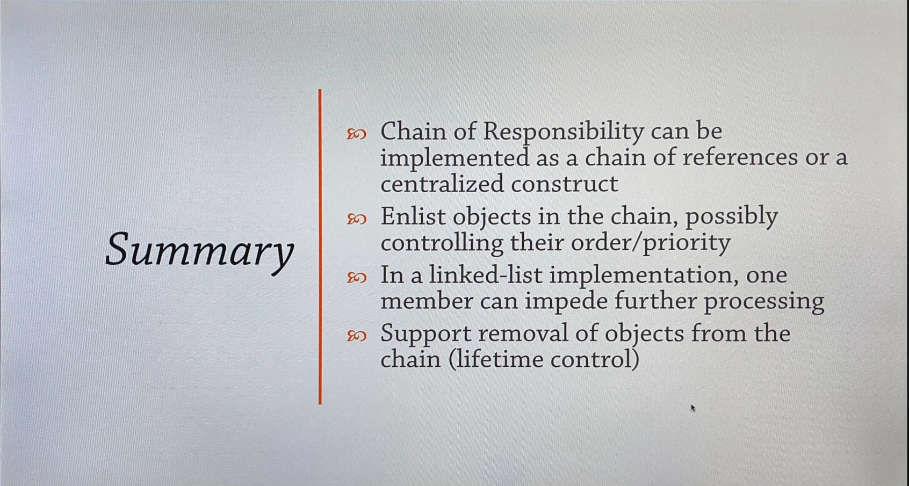

# Chain Of Responsibility Design Pattern

A chain of components who all get a chance to process a command or a query, optionally having default processing implementation and an ability to terminate the processing chain.

