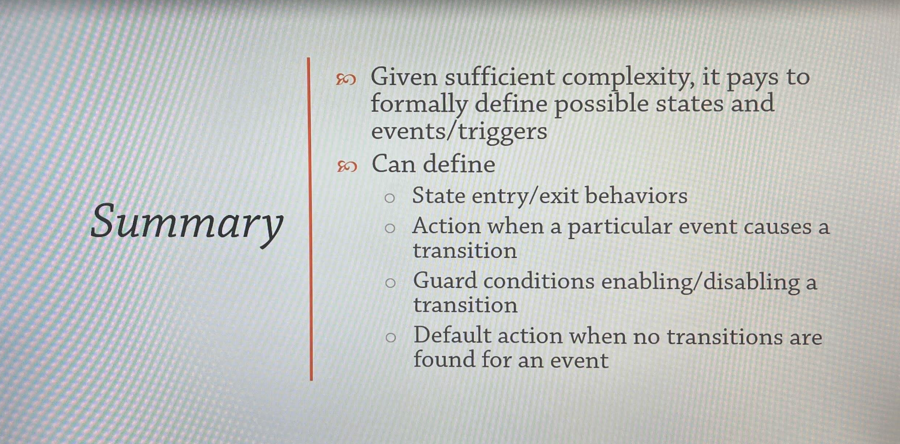

# State Design Pattern

A pattern in which the object's behavior is determined by its state. An object transitions from one state to another(something needs to _trigger_ a transition).

A formalized construct which manages state and transitions is called a _state machine_.

