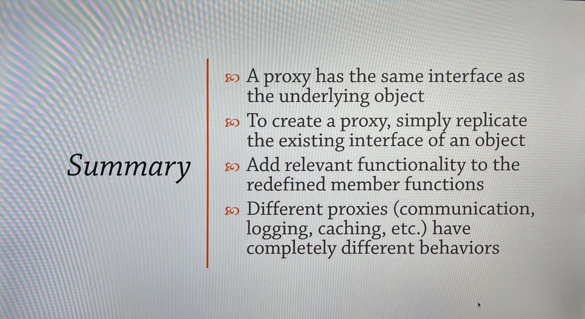

# Proxy Design Patterm

A class that functions as an interface to a particular resource. That resource may be remote, expensive to construct, or may require logging or some other added functionality.

